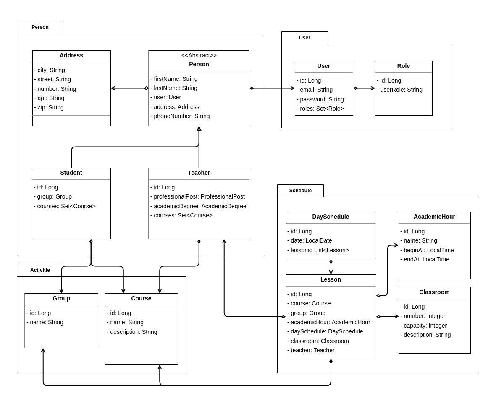

# University Management System
This is a Java-based web application built with Spring Boot and various other Spring modules. The system aims to simplify the management of students and teachers, as well as the class schedules at a university.
## UML diagram:

## Technologies Used
* [Java 17](https://docs.oracle.com/en/java/javase/17/)
* [Maven](https://maven.apache.org/guides/index.html)
* [Spring Boot 3.0.3](https://spring.io/projects/spring-boot)
* [Spring Web MVC]()
* [Spring Data JPA](https://spring.io/projects/spring-data-jpa)
* [Flyway](https://flywaydb.org/)
* [PostgreSQL](https://www.postgresql.org/)
* [Testcontainers](https://www.testcontainers.org/)
* [Junit 5](https://junit.org/junit5/)

[//]: # (* [Spring Security]&#40;https://spring.io/projects/spring-security&#41;)

## Features

[//]: # (Admin and user authentication and authorization using Spring Security.)
Management of students and teachers, including the ability to add, delete, and modify their information.
Management of class schedules, including the ability to add, delete, and modify class sessions.

A user-friendly web interface for easy navigation and interaction with the system.

### Installation and Usage
* Clone the repository to your local machine.
* Package jar with './mvnw package' command
* Run 'docker-compose.yml' to expose the application to Docker container.
* Access the web interface at http://localhost:8080/.

[//]: # (### Contributing)
[//]: # (Contributions to this project are welcome. Please feel free to open a pull request or an issue if you encounter any problems or have suggestions for improvement.)

### Acknowledgments
This project was developed as part of an educational course on java development. Special thanks to our course mentors for their guidance and support.